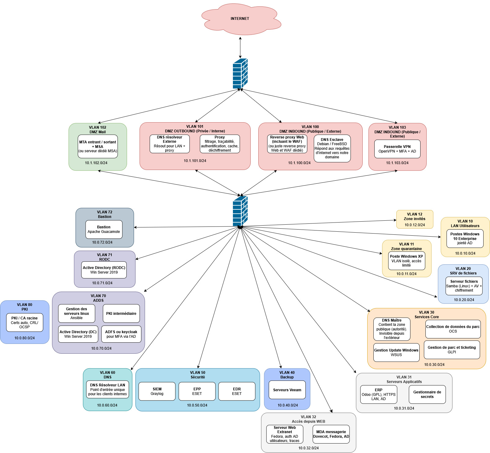

# [Projet P@8 Sécurité - Refonte d'un SI de PME](./sujet_Projet_securite_v3.0b.pdf)

> ⚠️ **Projet en cours de réalisation.**

## Contexte

Projet du module **P@8 Sécurité** (M1, Efrei Paris), réalisé par une équipe de 8 étudiants.

Scénario : une PME victime d'un grave incident de sécurité a perdu l'intégralité de son SI et nous mandate, en tant qu'ingénieurs SSII, pour le reconstruire intégralement. Contraintes : solutions libres et gratuites en priorité, versions stables, montée en charge jusqu'à 1000 utilisateurs simultanés, conformité légale.

[sujet ici](./sujet_Projet_securite_v3.0b.pdf)
---

## Architecture

 

**Choix de l'architecture :**

- **DMZ en sandwich** entre deux pare-feu de marques différentes (pfSense / OPNsense) => défense en profondeur, pas de point unique de compromission lié à une CVE éditeur
- **DMZ segmentée en 4 sous-zones** (INBOUND, OUTBOUND, Mail, VPN) => cloisonnement des flux entrants/sortants et des services en fonction de leur exposition
- **VLAN dédiés par fonction** côté LAN => application stricte du principe de moindre privilège réseau
- **Bastion** comme unique point d'entrée pour l'administration pour une meilleur traçabilité.

---

## Stack technique

### Choix actés

| Brique | Technologie | RACI |
|---|---|---|
| Hyperviseur | VMware ESXi 8.0 U2 | RA |
| Firewall externe | pfSense 2.8 | RA |
| Firewall interne | OPNsense | RA |
| Annuaire | Windows Server 2019 (AD DS + RODC) | I |
| OS messagerie / extranet | Fedora *(imposé)* | I |
| OS DNS public | FreeBSD *(imposé)* | C |
| ERP | Odoo (GPL) | I |
| Bastion | Apache Guacamole | C |
| SIEM | Graylog | R |
| EPP / EDR | ESET (licence obtenue en les ayant contactés)| RA |
| Sauvegarde | Veeam | C |
| Serveur de fichier | Samba | I |
| VPN client to site | OpenVPN  pour site to site avec la succursale | C |
| VPN site to site avec la succursale| Wireguard ou ipsec (pas encore décidé) | C |
| Gestion de parc | OCS Inventory + et/ou Ansible | RA |
| Mises à jour Windows | WSUS | C |
| Automatisation Linux | Ansible | RA |
| MFA + SSO DMZ | Keycloak | RA |
| PKI | Openssl (CA racine) + Dogtag (le reste) | R |

### À valider

| Brique | Pistes | RACI |
|---|---|---|
| Proxy + filtrage URL | Squid + e2guardian | RA |
| Reverse proxy + WAF | Nginx + ModSecurity / HAProxy | I |
| MTA / MDA | Postfix + Dovecot | I |

---

## Avancement

### Livrables

- [x] Schéma d'infrastructure *(30 avril)*
- [x] Analyse de risques *(18 mai)*
- [x] Service minimum opérationnel *(31 mai)*
- [ ] Document d'architecture *(15 juin)*
- [ ] Fiches réflexes administrateur *(15 juin)*
- [ ] Matrice RACI *(29 juin)*
- [ ] Pricing externalisation messagerie + addendum risques *(soutenance)*
- [ ] Analyse coûts + impact environnemental *(soutenance)*
- [ ] Soutenance finale
